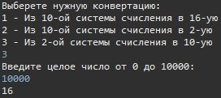

LDokhoyanTest
===============
I have solved the technical task from Neostudy =) 

> This is a console application with which you can convert from one number system to another, namely:
> * (from decimal to hexadecimal) == (10 -> 16)
> * (from decimal to binary) == (10 -> 2)
> * (from binary to decimal) == (10 -> 2)

An example of working in this application:
>

At startup, you will be asked to choose one of three operations. Then you will need to enter a number in the required number system, after which the number you need will be displayed in the console.
--------------------------------------------------------------------------------------------------------------------------------------------------------------

I hope I was helpful. For all questions and suggestions,  write to me by email: **dokhoyan-leva@mail.ru**
